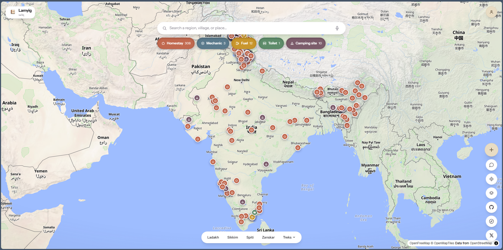

# Lamyig (ལམ་ཡིག)

**The open road-book for remote India.**

Lamyig is an open-source, community-maintained travel knowledge map for remote India, starting with the Himalaya (Spiti, Ladakh, Zanskar, Sikkim) and Dharamkot. Spiti can be downloaded for offline browsing; other regions currently require connectivity.

**Live at [www.lamyig.in](https://www.lamyig.in).**

It is not a booking platform. It is a shared record of what travellers and locals actually know: where the homestays are, where the mechanic is, where you can refill water, where the road is broken, where the network dies. The kind of knowledge that today lives only in tea stalls, WhatsApp groups, and the memory of the last rider who passed through.

## The name

In Tibetan tradition, a *lamyig* (ལམ་ཡིག - "road writing") was a handwritten route guidebook. It described paths, stops, water sources, and dangers for pilgrims and travellers crossing the Himalaya - geography, history, and spiritual significance together, not just directions. Guides to hidden valleys (*beyul*) were written as lamyigs.

This project is the community's lamyig, rebuilt for travellers who cannot assume a reliable signal. The name is also the ambition, not just the etymology - see [issue #7](https://github.com/aksharrrrr/Lamyig/issues/7) for where this is meant to go.

## Status

**Public beta.** Browse, search, add, edit, report, and download Spiti for offline browsing at [www.lamyig.in](https://www.lamyig.in). Everything in `/docs` is the source of truth for what Lamyig is and why - start with [`docs/14-decision-log.md`](docs/14-decision-log.md) if you're wondering why something works the way it does.

## What Lamyig believes

- Knowledge over listings. We collect facts, not advertisements.
- Facts over ratings. Structured, verifiable information instead of star reviews.
- Offline where it matters. Spiti is the first downloadable region; the same model can expand after field validation.
- Quality over coverage. 400 verified places beat 40,000 poor listings.
- Community-owned. The data, the code, and the decisions are open.

## Documentation

Start with [`docs/00-executive-summary.md`](docs/00-executive-summary.md). Every major decision and its reasoning is recorded in [`docs/14-decision-log.md`](docs/14-decision-log.md).

## Contributing

Want to add or improve a place, or contribute code? See [`CONTRIBUTING.md`](CONTRIBUTING.md). Security concerns go in [`SECURITY.md`](SECURITY.md).

## License

Code is MIT licensed, see [`LICENSE`](LICENSE). Factual database contributions are offered under ODbL 1.0; original contributed text and photographs are offered under CC BY 4.0. See the in-app Contribution Terms and D-021 in the decision log.
